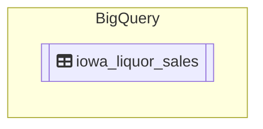
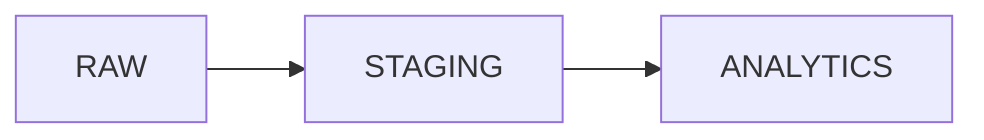

# Yalo Challenge

## Task 1 | Data Lake | Iowa Liquor Retail Sales 

### Data Lineage

### Data Layers

 * RAW
 * STAGING
 * ANALYTICS

## Task 3 | Chuck Norris Jokes

 * [Chuck Norris Jokes DAG code →](dags/dag_chuck_norris_jokes/chuck_norris_jokes.py)