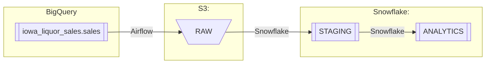
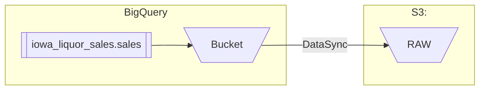
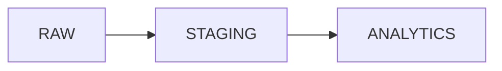

# Yalo Challenge

## Task 1 | Data Lake | Iowa Liquor Retail Sales 

### Data Lineage

 * Implemented

 * Recommended Alternative: Use [DataSync](https://docs.aws.amazon.com/datasync/latest/userguide/tutorial_transfer-google-cloud-storage.html)

### Data Layers

 * RAW
   * Ingested data without transformations
 * STAGING
   * Working zone for transformations like
     * Cleaning
     * Standardization
     * Create new data
 * ANALYTICS
   * Exposed layer
   * Business tables

## Task 3 | Chuck Norris Jokes

 * [Chuck Norris Jokes DAG code →](dags/dag_chuck_norris_jokes/chuck_norris_jokes.py)